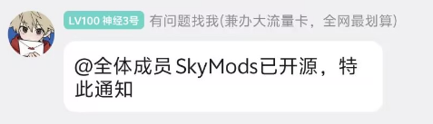
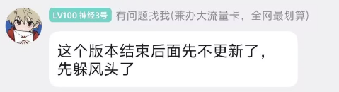
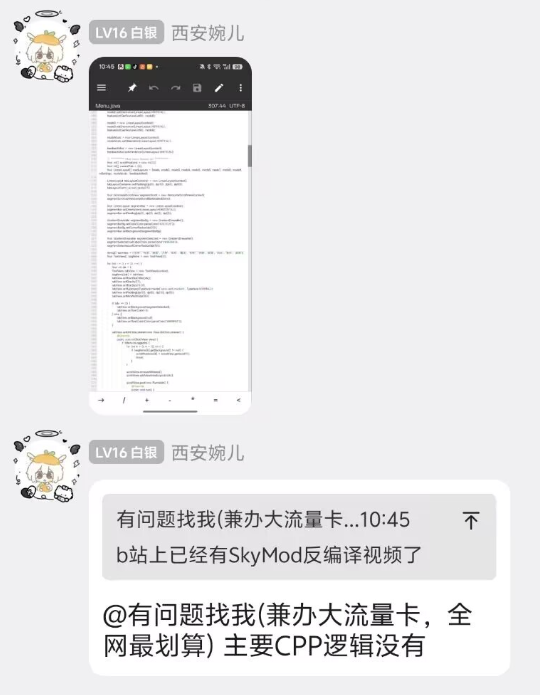
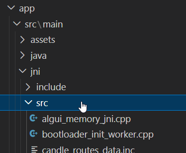
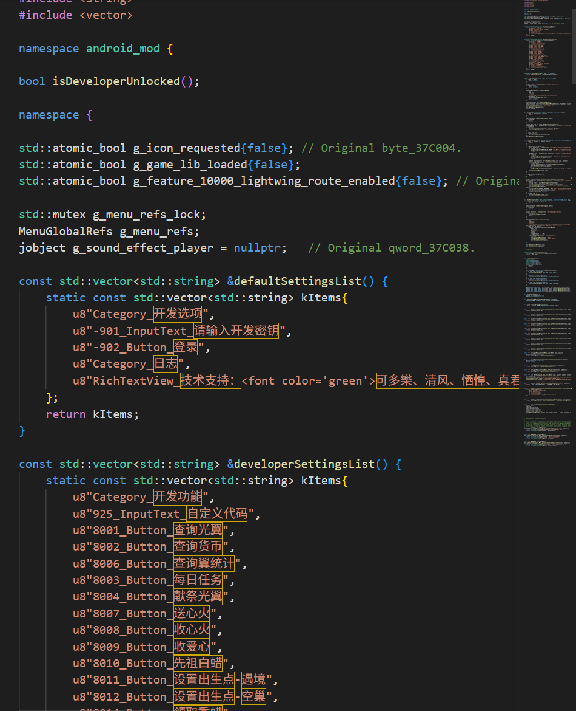
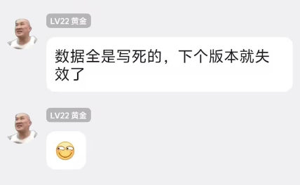
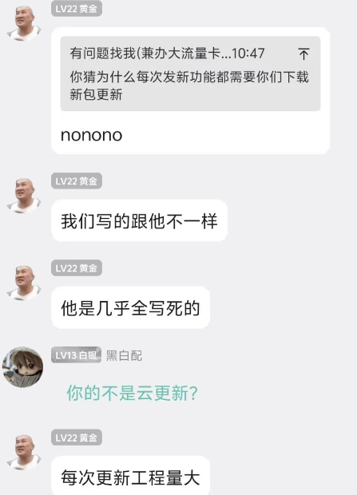

# OpenSkyMods

**请注意，所有责任归属原作者，本仓库拥有者不对内容负责。本仓库的内容仅用于参考，如果游戏公司对本仓库的内容有意见请通过Issue或任何方式联系我们删除**


SkyMods是一个非常垃圾的光遇游戏外挂，笔者从来没有玩过这个游戏只是非常随机的看到了这个外挂的广告并觉得这个外挂是傻逼于是笔者花费了不超过5分钟将这个外挂反编译并还原为了原始码。

笔者建议不要花费一分钱购买这个外挂，否则可能因为这个外挂中过于奇妙深刻的代码导致大脑降级，同时这个外挂的作者的智力可能不超过90，导致看不懂他抄袭的开源仓库右侧的License是什么意思，导致这个外挂的作者不仅使用了GPL 3.0的代码没有任何注明且没有按照GPL 3.0的规定开源项目。


> 此外挂的弱智圈钱广告

此外挂的作者不仅智力有问题，视力也有问题，他的外挂充斥着非常多UI不对齐这种弱智问题，任何攻读过小学美术的小朋友都应该知道设计的最基础的要求是对齐，很显然这个外挂的作者的学历并没有任何机会攻读这一学位，导致他的外挂圆角甚至没能对齐。


### 信息流通这一块

很显然这个外挂内部对信息的流通都高达0%，在笔者向他们交流群内部的人员大全发送骚扰邮件之后，真的有此外挂的代理觉得是官方开源了，甚至还艾特全体成员特此通知。

因为此人并不是这个的外挂的开发者，只是一个狗腿子

在早上8点也就是高达5个甚至4个小时之后这个人终于反应过来，发送了一些维稳声明。




### 全身上下只有嘴是硬的

在此人终于反应过来被搞了之后，开始强势嘴硬，声称笔者的开源代码不包含**他们没有发布的功能，所以这不是完整代码**，成功给笔者的一颗睾丸笑炸，笔者建议此人立刻支付我的医疗账单。

在此人嘴硬了不超过5纳秒之后，就发布了Discontinue声明，临时退网。




### 视力问题

很显然除了这个外挂的管理员，这个外挂的群成员的视力或者智力也都存在问题，以cpp逻辑都没有为理由尬黑，然而只要你的视力超过0.1，就能看到`app/src/main/jni`下面有一大坨cpp源码，下次不会黑可以别尬黑，笔者建议此人立刻前往最近的眼科医院进行就诊。





### 开源的代码是混淆过的

很显然这个管理员在嘴硬并车欠了不到三分钟，可能是看到代码里有一个proguard规则立刻开始鬼脑发力，意淫出来了笔者开源的代码有混淆。

但是但凡此人点开任何一个源码，都会看到没有任何代码被混淆，可能是此人的大脑脱机处理能力堪比一条蛆，导致认为所有他看不懂的代码都混淆了吧。




### 数据全是写死的

令人蒙古的是原来那个外挂就是全写死的，可能是大脑过于低级，认为所有外挂都需要对所有Offset实现Pattern Scanner才是好外挂。





## 使用方法

如果你不会使用可以直接去[Release页面](https://github.com/zero-delimiter/OpenSkyMods/releases)下载注入好的apk。

导入 Android Studio 里面编译打包出 `apk-debug.apk`（或者直接下载 Actions 自动构建的成品）。解压提取出该 apk 内的多个 DEX 文件（如 `classes.dex`、`classes2.dex`、`classes3.dex` 等），将它们**合并为一个完整的 `classes[数字].dex`**。随后，将这个合并好的 DEX 文件以及相关的 SO 库一同塞入目标包内。注意：目标包需要提前完成脱壳。

在 `StubApp`（或自定义 Application）的如下位置插入初始化代码：

```java
// Java
public void attachBaseContext(Context context) {
    super.attachBaseContext(context);
    Main.Start(this); // <- 插入此行
    ...
}

// Smali
.method public attachBaseContext(Landroid/content/Context;)V
    .registers 11

    invoke-super {p0, p1}, Landroid/app/Application;->attachBaseContext(Landroid/content/Context;)V

    invoke-static {p0}, Lcom/android/support/Main;->Start(Landroid/content/Context;)V // <- 插入此行
    ...
```

在 `AndroidManifest.xml` 中插入悬浮窗权限：

```xml
<uses-permission android:name="android.permission.SYSTEM_ALERT_WINDOW"/>
```

插入服务类：

```xml
<service
    android:name="com.android.support.Launcher"
    android:enabled="true"
    android:exported="true"
    android:stopWithTask="true"/>
```

开启调试模式：

```xml
<application
        android:theme="@style/..."
        android:label="@string/app_name"
        android:icon="@drawable/icon"
        android:name="..."
        android:debuggable="true" <!-- 插入这个 -->
        android:allowBackup="false"
        android:fullBackupOnly="true"
...
```

如果你要用开发者功能可能需要插入：

```xml
<uses-permission android:name="android.permission.MANAGE_EXTERNAL_STORAGE"/>
```

## 开源协议

本项目采用 GNU General Public License v3 (GPLv3) 开源协议。

这意味着：

* 你可以：免费下载、使用、修改和分发本项目的代码。
* 但必须：如果你修改了本项目代码或在你的项目中引入了本项目，你的项目也必须以 GPLv3 协议开源，并公开源代码。
* 严禁：将本项目代码用于闭源的商业软件。

## 致谢

- [SkyMods Team](https://t.me/Skyairen): 制作这个外挂
- [ChatGPT](https://chatgpt.com): 在人工的监督下协助完成还原
- [Android-Mod-Menu](https://github.com/LGLTeam/Android-Mod-Menu)：被SkyMods外挂抄袭
- [AlguiPlus](https://github.com/chunjie008/AlguiPlus/tree/main)：被SkyMods外挂抄袭
